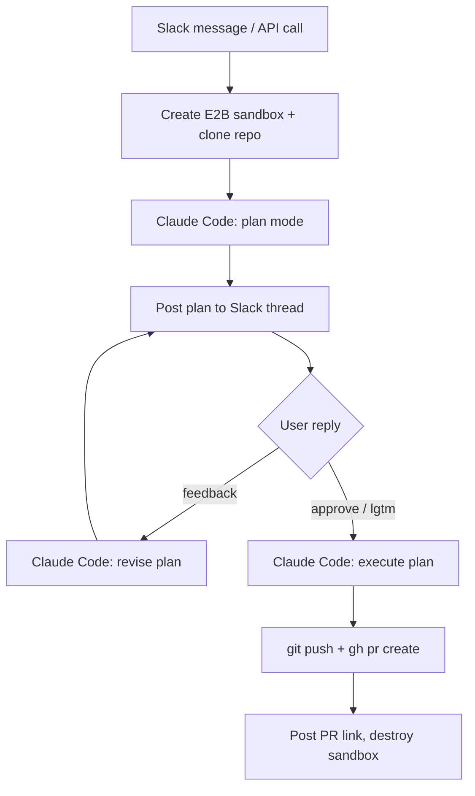

# Sandbox Coding Workflow

The sandbox coding workflow spins up an [E2B](https://e2b.dev/) cloud sandbox, runs Claude Code in plan mode, and lets you iterate on the plan via Slack before executing and creating a GitHub PR.

## Flow



## Prerequisites

- **E2B account** with an API key ([e2b.dev/dashboard](https://e2b.dev/dashboard))
- **Python 3 + `e2b` package** installed on the ZeroClaw host (`pip install e2b`) -- used for sandbox command execution
- **Slack channel** configured in ZeroClaw
- **GitHub access** via `GH_TOKEN` environment variable
- **Claude Code auth** via Max subscription or `ANTHROPIC_API_KEY`

## Setup

### 1. Build the E2B template

The `e2b/` directory at the repo root contains the sandbox template with Claude Code, git, and the GitHub CLI pre-installed.

```bash
# Install the E2B CLI
npm install -g @e2b/cli

# Authenticate
e2b auth login

# Build the template (from the repo root)
cd e2b
e2b template build -n zeroclaw-claude-code
```

Note the template ID from the output (e.g. `abc123xyz`).

### 2. Configure ZeroClaw

Add to your `config.toml`:

```toml
[sandbox_workflow]
enabled = true
e2b_template = "abc123xyz"              # from step 1
default_slack_channel = "C0123ABCDEF"   # your Slack channel ID
git_user_name = "Your Name"
git_user_email = "you@example.com"
```

### 3. Set environment variables

Add to your `docker-compose.yml`:

```yaml
environment:
  - E2B_API_KEY=your-e2b-api-key
  - GH_TOKEN=your-github-token
```

### 4. Authenticate Claude Code (Max subscription)

If you have a Claude Max subscription, you can use it instead of an API key:

```bash
# Install Claude Code in the ZeroClaw container (one-time)
docker exec -it zeroclaw npm install -g @anthropic-ai/claude-code

# Log in with your Max subscription
docker exec -it zeroclaw claude auth login
```

Complete the OAuth flow in your browser. The credentials are stored at `/zeroclaw-data/.claude/.credentials.json` inside the container, persisted via your volume mount. Each E2B sandbox receives a copy of this file automatically.

If the token expires, re-run `claude auth login`.

**Alternative:** Set `ANTHROPIC_API_KEY` in your `docker-compose.yml` instead. This is billed separately from your Max subscription but requires no interactive login.

### 5. Verify

```bash
# Check the tool is registered
curl http://localhost:42617/api/tools | jq '.[] | select(.name == "sandbox_coding_task")'

# Check workflow list (empty initially)
curl http://localhost:42617/api/sandbox-workflows
```

## Usage

### Via Slack

Send a message to ZeroClaw in Slack:

> Run a sandbox coding task on https://github.com/myorg/myrepo to add input validation to the signup form

ZeroClaw will invoke the `sandbox_coding_task` tool and post the plan in a new Slack thread.

### Via Gateway API

```bash
curl -X POST http://localhost:42617/api/message \
  -H "Content-Type: application/json" \
  -d '{
    "message": "Use sandbox_coding_task to add input validation to the signup form",
    "tool_hint": "sandbox_coding_task",
    "args": {
      "task": "Add input validation to the signup form",
      "repo_url": "https://github.com/myorg/myrepo",
      "slack_channel": "C0123ABCDEF",
      "branch": "main"
    }
  }'
```

### Iterating on the plan

Once the plan is posted to your Slack thread:

- **Reply with feedback** to refine it (e.g., "also handle email format validation")
- **Reply `approve`**, `lgtm`, `ship it`, `go`, `execute`, or `run it` to execute

The plan will be revised and re-posted for each round of feedback, up to `max_iterations` (default: 10).

### Checking workflow status

```bash
curl http://localhost:42617/api/sandbox-workflow/{workflow_id}
```

Returns the current state, repo URL, task, PR URL (when created), and iteration count.

## Configuration Reference

All fields in the `[sandbox_workflow]` config section:

| Field | Type | Default | Description |
|-------|------|---------|-------------|
| `enabled` | bool | `false` | Enable the tool and API endpoints |
| `e2b_api_key` | string | `""` | E2B API key (falls back to `E2B_API_KEY` env var) |
| `e2b_template` | string | `""` | E2B custom template ID |
| `e2b_api_url` | string | `"https://api.e2b.dev"` | E2B API base URL |
| `sandbox_timeout_secs` | u64 | `3600` | Sandbox time-to-live (seconds) |
| `max_iterations` | u32 | `10` | Max plan revision rounds |
| `plan_timeout_secs` | u64 | `300` | Timeout per Claude Code plan invocation |
| `exec_timeout_secs` | u64 | `900` | Timeout for execution phase |
| `approval_timeout_secs` | u64 | `86400` | Time to wait for approval (24h) |
| `default_slack_channel` | string | `null` | Fallback Slack channel ID |
| `env_passthrough` | list | `[]` | Extra env vars forwarded to sandbox |
| `git_user_name` | string | `null` | Git author name for commits |
| `git_user_email` | string | `null` | Git author email for commits |
| `claude_credentials_path` | string | `null` | Path to `.credentials.json` (defaults to `$HOME/.claude/.credentials.json`) |

## Tool Parameters

The `sandbox_coding_task` tool accepts:

| Parameter | Required | Description |
|-----------|----------|-------------|
| `task` | yes | The coding task description |
| `repo_url` | yes | Git repository URL to clone |
| `slack_channel` | no | Slack channel ID (falls back to config default) |
| `branch` | no | Base branch to work from |

## Workflow States

| State | Description |
|-------|-------------|
| `initializing` | Creating sandbox, cloning repo |
| `planning` | Claude Code generating plan |
| `awaiting feedback` | Plan posted, waiting for user |
| `revising plan` | Claude Code revising based on feedback |
| `executing` | Plan approved, Claude Code making changes |
| `creating PR` | Pushing branch and creating GitHub PR |
| `completed` | PR created, sandbox destroyed |
| `failed` | Error occurred, sandbox destroyed |

## Troubleshooting

**"No Slack channel available"** -- Ensure Slack is configured in your `config.toml` channels section and the bot is running.

**"E2B create sandbox failed"** -- Check your `E2B_API_KEY` and `e2b_template` values. Verify the template exists with `e2b template list`.

**Claude Code auth fails in sandbox** -- Either set `ANTHROPIC_API_KEY` or run `docker exec -it zeroclaw claude auth login` to populate the credentials file.

**Plan times out** -- Increase `plan_timeout_secs`. Large repos may need more time for the initial plan.

**Token expired** -- Re-run `docker exec -it zeroclaw claude auth login`. The next workflow will pick up the refreshed credentials.
